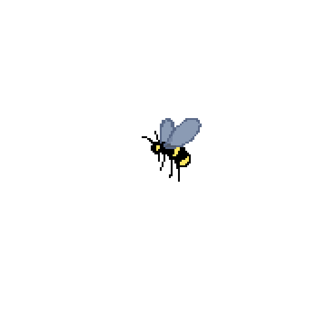

<h1 align="left">Beby Kurniawan - Front-End 
   
</h1>

   
###

A junior programmer who is passionate about exploring the world of coding and software development.    I have an educational background in computer science and have completed various courses and small projects to deepen my understanding of the world of programming.

###

<h2 align="left">Personal Website</h2>

###

Coming soon😬

###

<h2 align="left">Languages I've played with</h2>

###

  
  
  
  
  

###

## Stats Github

  
  

